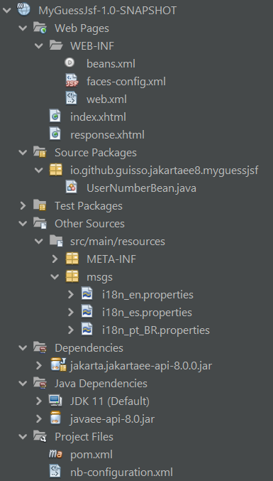

# MyGuessJsf

A Jakarta EE Web Application with a JSF guessing number game.

## Suggested analysis order

1. [web.xml](/src/main/webapp/WEB-INF/web.xml)
2. [faces-config.xml](/src/main/webapp/WEB-INF/faces-config.xml)
3. [i18n_pt_BR.properties](/src/main/resources/msgs/i18n_pt_BR.properties)
4. [i18n_en.properties](/src/main/resources/msgs/i18n_en.properties)
5. [i18n_es.properties](/src/main/resources/msgs/i18n_es.properties)
6. [UserNumberBean.java](/src/main/java/io/github/guisso/jakartaee8/myguessjsf/UserNumberBean.java)
7. [index.xhtml](/src/main/webapp/index.xhtml)
8. [response.xhtml](/src/main/webapp/response.xhtml)

## Reference

I took some inspirations and made some adaptations to the original project "Developing a Simple Facelets Application: The guessnumber-jsf Example Application"

<https://eclipse-ee4j.github.io/jakartaee-tutorial/jsf-facelets003.html>
